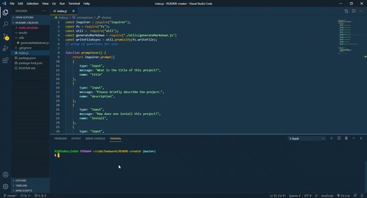

# README-creator

This is an application that is designed to procedurally generate README files using node. Users annswer a few inquirer prompts, after which a README file about their project is generated. Inquirer is required, but it is alreadly inside the package.json file, so users only need to run an npm install in order for node to have everything it needs to run the app (assuming of course that the user has node installed).

You can view a youtube video demoing this application [here](https://youtube.com/watch?v=o9jW6jhYkJw&feature=youtu.be)

